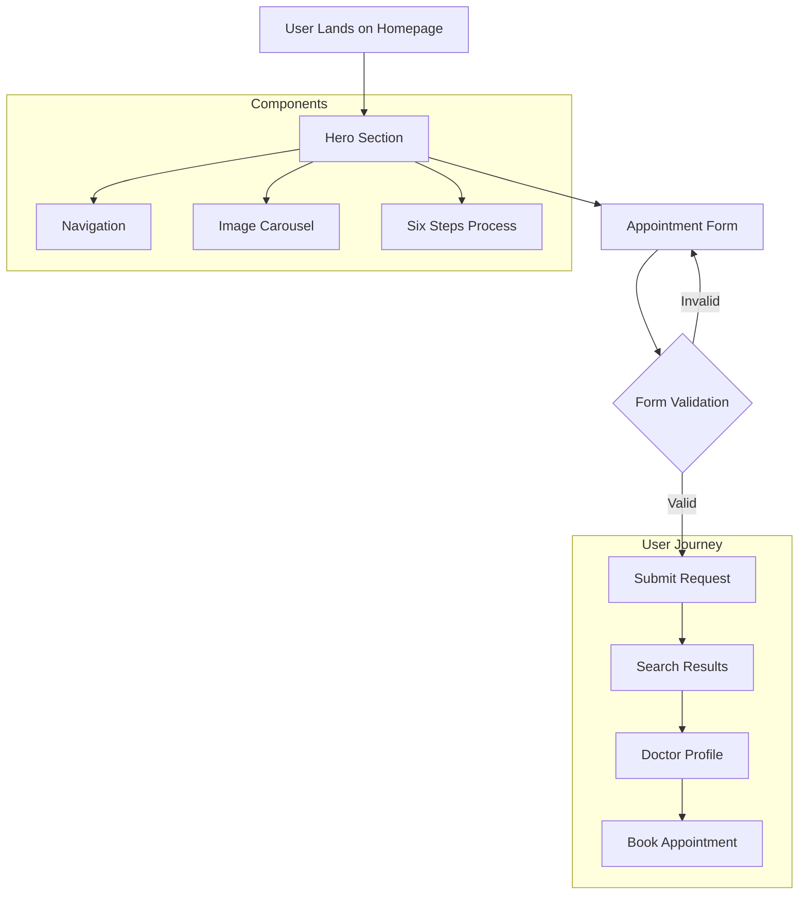
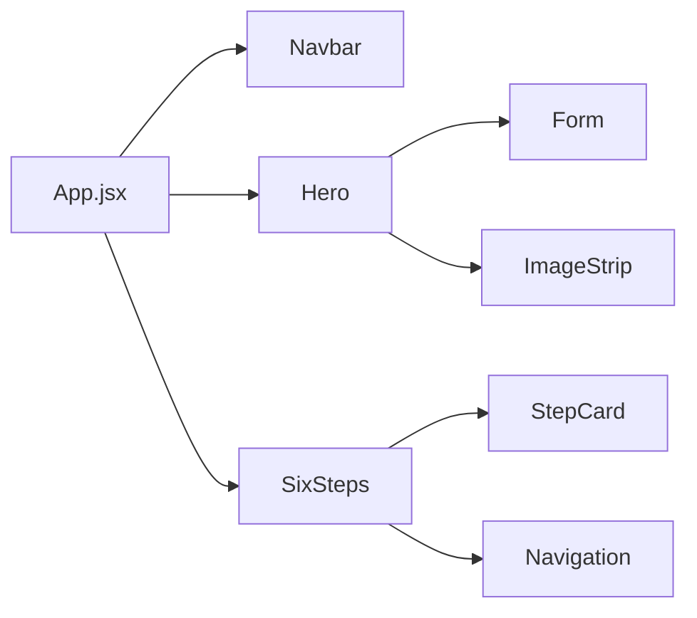
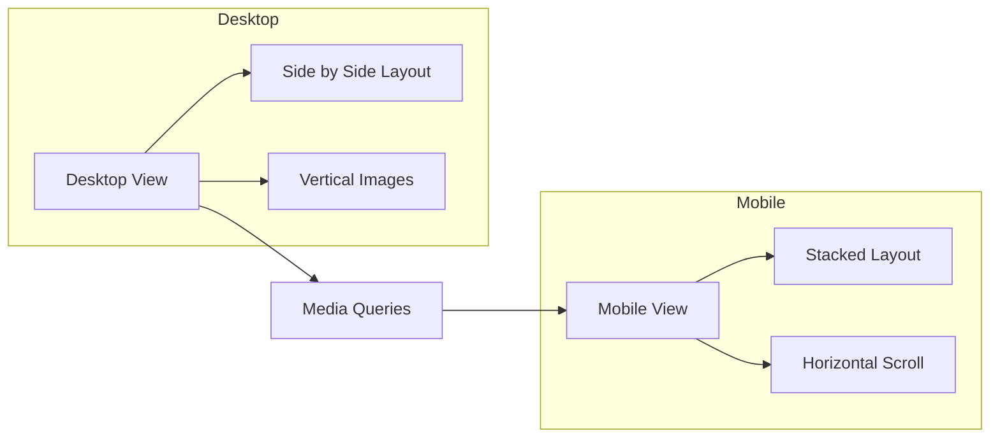

# ProVital - Modern Healthcare Appointment Platform

## 🌟 Overview
ProVital simplifies connecting patients with lifestyle medicine experts through an intuitive appointment booking platform.

## 📊 System Architecture

### User Flow


### Component Structure


### Responsive Design Flow


## 🚀 Getting Started

### Prerequisites
- Node.js (v16 or higher)
- npm (v8 or higher)

### Installation
```bash
# Clone repository
git clone https://github.com/yourusername/pro-vital.git

# Navigate to project directory
cd pro-vital

# Install dependencies
npm install

# Start development server
npm run dev
```

## 📁 Project Structure
```
pro-vital/
├── src/
│   ├── components/
│   │   ├── Hero/
│   │   │   ├── Hero.jsx        # Main landing component
│   │   │   └── Hero.css        # Hero styles
│   │   ├── Navbar/
│   │   │   ├── Navbar.jsx      # Navigation component
│   │   │   └── Navbar.css      # Navigation styles
│   │   └── SixSteps/
│   │       ├── SixSteps.jsx    # Process flow component
│   │       └── SixSteps.css    # Step styles
│   ├── assets/
│   │   └── images/             # Image resources
│   └── App.jsx                 # Root component
└── package.json               # Dependencies
```

## 💻 Technical Stack
- **Frontend Framework**: React.js 18.0
- **Build Tool**: Vite
- **Styling**: CSS3 with Media Queries
- **State Management**: React Hooks
- **Version Control**: Git
- **Package Manager**: npm
- **Development Environment**: VS Code

## 🎨 Design System

### Color Palette
```css
:root {
  --primary: #00BCD4;
  --secondary: #4CAF50;
  --text-dark: #1A1A1A;
  --text-light: #666666;
  --gradient: linear-gradient(135deg, #FFE4D6, #FFB1C8);
}
```

### Typography
- **Headings**: 32px (Desktop) / 28px (Mobile)
- **Body Text**: 16px
- **Input Fields**: 15px

## 📱 Mobile Optimization
- Fixed Navigation Header
- Centered Content Layout
- Touch-optimized Form Inputs
- Horizontal Scrolling Galleries
- Responsive Text Scaling

## 🛠️ Development

### Available Commands
```bash
# Development server
npm run dev

# Production build
npm run build

# Preview production
npm run preview
```

### Dependencies
```json
{
  "react": "^18.0.0",
  "react-dom": "^18.0.0",
  "react-icons": "^4.0.0"
}
```

## 🔍 Core Components

### Hero Section
- Main landing component
- Appointment booking form
- Scrolling image showcase
- Gradient background effects

### Navigation
- Responsive header
- Mobile menu integration
- Brand elements

### Six Steps Process
- Visual process flow
- Interactive step cards
- Responsive layout adaptation

## 🤝 Contributing
1. Fork repository
2. Create feature branch (`git checkout -b feature/AmazingFeature`)
3. Commit changes (`git commit -m 'Add AmazingFeature'`)
4. Push to branch (`git push origin feature/AmazingFeature`)
5. Open Pull Request


